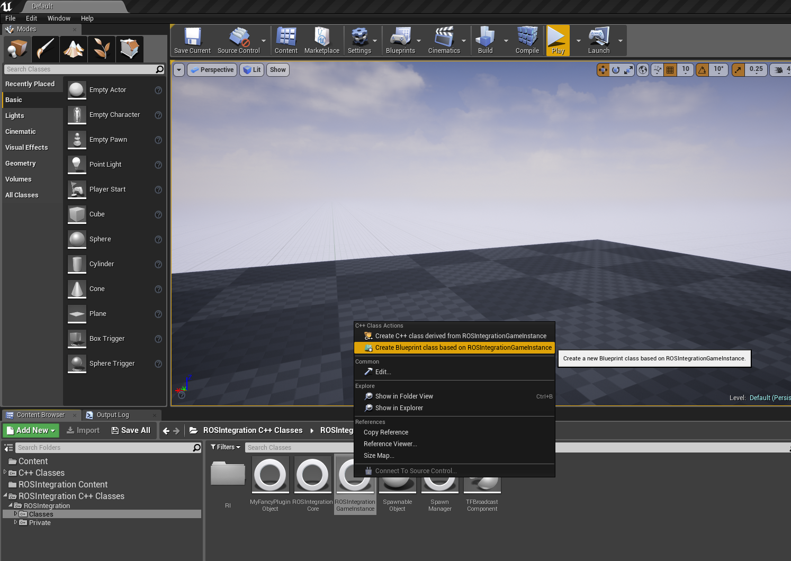
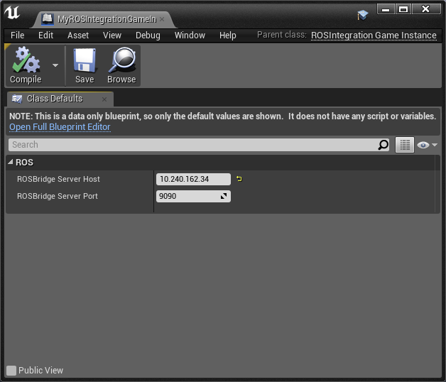
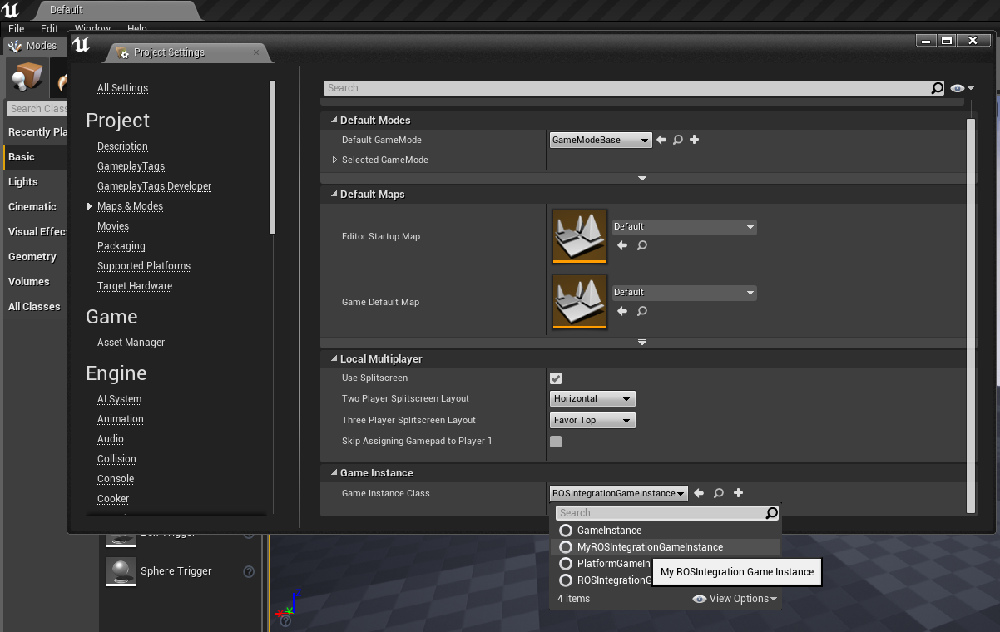
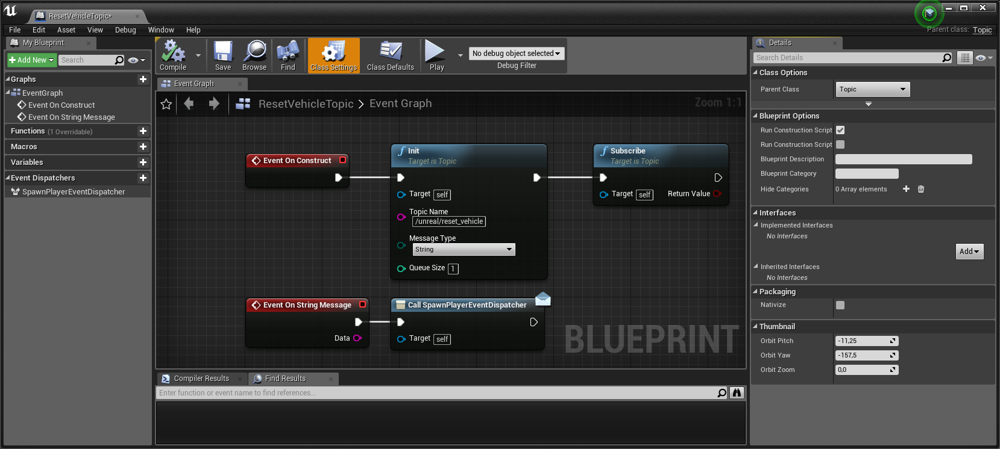
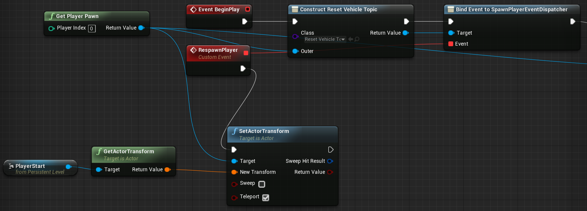

# ROSIntegration Plugin for Unreal Engine 4
This plugin adds ROS support to your Unreal Engine Project. It is designed to be used on different common platforms.
Currently, Windows and Linux are directly supported.

The connection to the ROS world will be accomplished through http://wiki.ros.org/rosbridge_suite and https://github.com/sanic/rosbridge2cpp

## Description

This Plugin contains the basic data structures to enable the user to communicate with a running roscore.
Currently, ROS Topics and ROS Services are supported.

To boost the performance for big messages (Image Streams for example), this plugin utilizes http://bsonspec.org/ to transfer binary data in a compact manner.

The core communication library behind this plugin is https://github.com/sanic/rosbridge2cpp, which allows the core communication capabilities to be developed, tested and improved by people who are not necessarily using it with Unreal Engine.

ROS Functionality can be added to UObjects or AActors by using functions like Advertise/Subscribe/Publish on the ROS Wrapper classes or in the form specific Unreal ActorComponents.
This currently includes an ActorComponent that can be added to AActors to easily publish their coordinates to TF.
If you need Vision Support in your Unreal Project, you can also add the ROSIntegrationVision Plugin (https://github.com/code-iai/ROSIntegrationVision/) which is compatible with this Plugin.

## Citations
If you are using this Plugin in an academic context and you want to cite us, we would be happy if you could use the following reference:
<pre>
@inproceedings{mania19scenarios,
  title = {A Framework for Self-Training Perceptual Agents in Simulated Photorealistic Environments},
  author  = {Patrick Mania and Michael Beetz},
  year = {2019},
  booktitle = {International Conference on Robotics and Automation (ICRA)},
  address = {Montreal, Canada}
}
</pre>

## Dependencies of this Plugin

This Plugin utilizes BSON to achieve higher transferrates for binary data.
It uses http://mongoc.org/libbson/ to encode and decode the whole ROS communication protocol.
Since BSON is not included in Unreal Engine (yet), its code has to be added to this plugin.
Currently, this plugin comes with a pre-compiled libbson for Windows x64 and Linux x64 which doesn't need any additional configuration.

To enable the communcation between Unreal and ROS, you will need a running ROSBridge (https://github.com/RobotWebTools/rosbridge_suite) with bson_mode. As an example for ROS kinetic, you can install it with:
```
sudo apt-get install ros-kinetic-rosbridge-suite
```
Note: Please use rosbridge with version=>0.8.0 to get full BSON support. After installing rosbridge, you can enable the bson_mode like this:

```
roslaunch rosbridge_server rosbridge_tcp.launch bson_only_mode:=True
```

This plugin has been tested with Unreal Engine versions;

 * 4.17.3
 * 4.18.2
 * 4.18.3
 * 4.19.1, 4.19.2
 * 4.20.3

## Usage

### Setting up the plugin

 * Create a new C++ Unreal Project, or open your existing project. Please note that the Plugin might not get compiled automatically in BP-only Projects (see [this Issue](https://github.com/code-iai/ROSIntegration/issues/19)).
 * Add this repository to your `Plugins/` Folder in your Unreal project (copy the folder in so your structure looks like `MyUnrealProject/Plugins/ROSIntegration/ROSIntegration.uplugin`
 * Activate the Plugin in your UE4 project by opening your project and go to Edit -> Plugins. Search for ROSIntegration in the "other" section and activate it.
 * Restart the editor and check that the code for the new plugin is built.
 * To specify your ROSBridge server, you have to create a custom GameInstance that inherits from [`ROSIntegrationGameInstance`](Source/ROSIntegration/Classes/ROSIntegrationGameInstance.h)
  * Find `ROSIntegrationGameInstance` in the Content browser (you might need to enable 'View Options' > 'Show Plugin Content' in the bottom right of the content browser).
  * Right click and create a new C++ or Blueprint class based on `ROSIntegrationGameInstance`

    

  * Open your new C++ class / Blueprint object and change the values of `ROSBridgeSeverHost` and `ROSBridgeServerPort`

    

  * Open Project Settings > Maps and Modes, and set the GameInstance to match **your new GameInstance object**, not `ROSIntegrationGameInstance`

    

 * Don't forget to save everything (Ctrl + Shift + S)
 * In some cases (for example on Linux), it might be necessary to call the Generate Project Files action on UE4 in order to fetch the new header files for the plugin. Reference: https://wiki.unrealengine.com/Generate_Visual_Studio_Project or https://wiki.unrealengine.com/Building_On_Linux#Generating_project_files_for_your_project

### C++ Topic Publish Example
To get started, you can create a new C++ Actor and let it publish a message once at the BeginPlay Event.
Add the following code into the BeginPlay() method of any actor that is put into to your world to see if the connection to ROS works:

```c++
#include "ROSIntegration/Classes/RI/Topic.h"
#include "ROSIntegration/Classes/ROSIntegrationGameInstance.h"
#include "ROSIntegration/Public/std_msgs/String.h"

// Initialize a topic
UTopic *ExampleTopic = NewObject<UTopic>(UTopic::StaticClass());
UROSIntegrationGameInstance* rosinst = Cast<UROSIntegrationGameInstance>(GetGameInstance());
ExampleTopic->Init(rosinst->ROSIntegrationCore, TEXT("/example_topic"), TEXT("std_msgs/String"));

// (Optional) Advertise the topic
ExampleTopic->Advertise();

// Publish a string to the topic
TSharedPtr<ROSMessages::std_msgs::String> StringMessage(new ROSMessages::std_msgs::String("This is an example"));
ExampleTopic->Publish(StringMessage);
```

### C++ Topic Subscribe Example

```c++
#include "ROSIntegration/Classes/RI/Topic.h"
#include "ROSIntegration/Classes/ROSIntegrationGameInstance.h"
#include "ROSIntegration/Public/std_msgs/String.h"

// Initialize a topic
UTopic *ExampleTopic = NewObject<UTopic>(UTopic::StaticClass());
UROSIntegrationGameInstance* rosinst = Cast<UROSIntegrationGameInstance>(GetGameInstance());
ExampleTopic->Init(rosinst->ROSIntegrationCore, TEXT("/example_topic"), TEXT("std_msgs/String"));

// Create a std::function callback object
std::function<void(TSharedPtr<FROSBaseMsg>)> SubscribeCallback = [](TSharedPtr<FROSBaseMsg> msg) -> void
{
    auto Concrete = StaticCastSharedPtr<ROSMessages::std_msgs::String>(msg);
    if (Concrete.IsValid())
    {
        UE_LOG(LogTemp, Log, TEXT("Incoming string was: %s"), (*(Concrete->_Data)));
    }
    return;
};

// Subscribe to the topic
ExampleTopic->Subscribe(SubscribeCallback);
```

### Blueprint Topic Subscribe Example

* Create a Blueprint based on `Topic` class.
* Subscribe to a topic.
* Define what happens when a message arrives.



* Open Level Bluprint or any other you want to use the topic in.
* Instantiate the blueprint via `Construct Object from Class` with a meaningful outer to define its lifetime and affiliation.



### C++ Service Request example

TODO

### Supported Message Types

Topic Message Type                 | ROS to UE4 | UE4 to ROS
---------------------------------- | ---------- | ----------
std_msgs/Header                    | ✓          | ✓
std_msgs/String                    | ✓          | ✓
std_msgs/Float32                   | ✓          | ✓
std_msgs/Float32MultiArray         | ✓          | ✓
std_msgs/MultiArrayDimension       | ✓          | ✓
std_msgs/MultiArrayLayout          | ✓          | ✓
std_msgs/UInt8MultiArray           | ✓          | ✓
tf2_msgs/TFMessage                 | ✘          | ✓
geometry_msgs/Point                | ✓          | ✓
geometry_msgs/Pose                 | ✓          | ✓
geometry_msgs/PoseStamped          | ✓          | ✓
geometry_msgs/PoseWithCovariance   | ✓          | ✓
geometry_msgs/Quaternion           | ✓          | ✓
geometry_msgs/Transform            | ✓          | ✓
geometry_msgs/TransformStamped     | ✓          | ✓
geometry_msgs/Twist                | ✓          | ✓
geometry_msgs/TwistWithCovariance  | ✓          | ✓
geometry_msgs/Vector3              | ✓          | ✓
grid_map_msgs/GridMap              | ✓          | ✓
grid_map_msgs/GridMapInfo          | ✓          | ✓
nav_msgs/Odometry                  | ✓          | ✓
rosgraph_msgs/Clock                | ✓          | ✓
sensor_msgs/CameraInfo             | ✘          | ✓
sensor_msgs/Image                  | ✓          | ✓
sensor_msgs/Imu                    | ✓          | ✓
sensor_msgs/PointCloud2            | ✓          | ✓
sensor_msgs/RegionOfInterest       | ✘          | ✘
sensor_msgs/LaserScan              | ✓          | ✓
actionlib_msgs/GoalID              | ✓          | ✓
actionlib_msgs/GoalStatus          | ✓          | ✓
actionlib_msgs/GoalStatusArray     | ✓          | ✓


Service Message Type               | ROS to UE4 | UE4 to ROS
---------------------------------- | ---------- | ----------
rospy_tutorials/AddTwoIntsRequest  | ✓          | ✓
rospy_tutorials/AddTwoIntsResponse | ✓          | ✓

### Implementing New Message Types

To be able to send and receive message types with ROSIntegration we need two things: the message definition, as well as a converter of the data in that definition from and to BSON. For reference how to do that look into the message definitions in `Source\ROSIntegration\Public`, and the converters in `Source\ROSIntegration\Private\Conversion\Messages`.

If you need one of the standard message types provided by ROS, you should implement them inside the ROSIntegration's folder structure. Please keep to the naming convention of the ROS documentation for the message definition.
If you want to implement your own messages you can do that in your own project. You only need to add something like the following to the Build.cs-file of your project:

```
string rosintegrationPath = Path.GetFullPath(Path.Combine(ModuleDirectory, "../../Plugins/ROSIntegration/Source/ROSIntegration/Private"));
PrivateIncludePaths.AddRange(
    new string[] {
        rosintegrationPath,
        rosintegrationPath + "/rosbridge2cpp"
    }
);
```

Then you can create the message definition and the converter in your own projects source tree. You can just copy and paste the files of a similar standard message, but don't forget to replace the `ROSINTEGRATION_API` with your own API macro created by Unreal.

### FAQ
* Question: My Topic/Service gets closed/unadvertised or my UE4 crashes around one minute after Begin Play.
Answer: This might be a problem relating to the Garbage Collection of UE4. Please make sure that you declare your class member attributes as UPROPERTYs. See also: https://github.com/code-iai/ROSIntegration/issues/32
